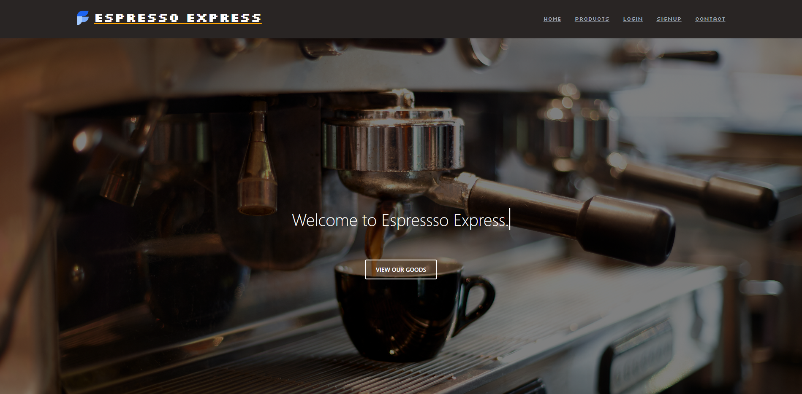

# Espresso-Express

## Description

A coffee shop that run both online and physical Business. Espresso Express sells many different types of coffe related products

## Table of Content
  - [Description](#description)
  - [Feature](#feature)
  - [Installation](#installation)
  - [Usage](#usage)
  - [Credits](#credits)
  - [License](#license)

## Feature

  - A coffee shop with Beans to sell
  
  - Different Products with Category tag on it

  - Coffee lovers can buy whatever you want

## Installation

Step 1: Clone the repo (HTTPS: `git clone https://github.com/louieiply/Espresso-Express.git` or SSH: `git@github.com:louieiply/Espresso-Express.git`)

Step 2: Install Node.js

Step 3: npm i (install all components from the package.json)

Step 4: npm run develop (run concurrently the frontend and backend)

## Usage

- The application has been deplayed to Heroku with a mongoDB Atlas

- The deployed application link [Click me](https://espresso-express-deployed.herokuapp.com/)

## Credits

TailWind Componenet Community Contributors, TailwindUI reference designs, Louie Ip & Peter Jolley. All Products resource references.  

## License
[MIT License - Copyright (c) 2022 Louie Ip & Peter Jolley.](./LICENSE)

